<p align="center">
  <picture>
    <source media="(prefers-color-scheme: dark)" srcset="icon-512.png">
    <source media="(prefers-color-scheme: light)" srcset="icon-512-light.png">
    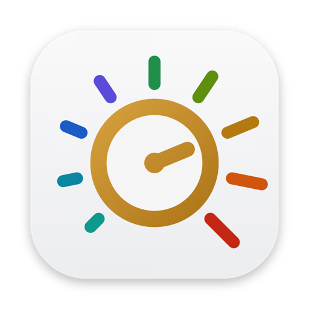
  </picture>
</p>

<h1 align="center">Dial</h1>

<p align="center"><b>An AI sound mixer — for macOS, Linux, ChromeOS and FreeBSD</b></p>

<p align="center">
  Version <b>1.0.2</b> · released 09 Oct 2026 ·
  <a href="https://github.com/JKS-sys/dial-08-oct-2026-releases/releases/latest">Download</a> ·
  <a href="https://ipconfig.co.network/dial">Website</a> ·
  <a href="RELEASE-NOTES.md">Release notes</a>
</p>

<p align="center">
  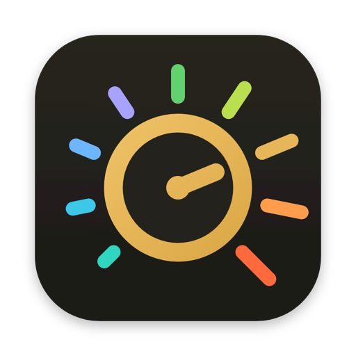&nbsp;&nbsp;
  
</p>

Dial gives every app its own volume, puts an equaliser on everything you hear, switches your speakers,
headphones and microphone, and fixes sound that is lopsided, too quiet or too harsh. Set it by hand, or just say
what you want — *“quieter music”, “more bass”, “calls to my headphones”* — and Dial AI moves the sliders.
A native desktop app of a few megabytes.

## See it move

<p align="center"></p>

**Startup** — the Dial knob draws itself: nine rainbow ticks pop in one by one, the gold pointer swings to rest with a click,
and *An AI sound mixer* types out. Click or press any key to skip it, or turn it off in Settings.

<p align="center"></p>

**Menu bar popover** — click the knob in the menu bar and every device and app is one glance away: live level meters,
a volume slider per app, boost chevrons that light up one by one (200 → 300 → 400 %), a globe to send one app to its own
output, a one-click output switch, the live microphone level with a big *Mute microphone* switch — and Bluetooth
headphones that connect right from the list.

<p align="center">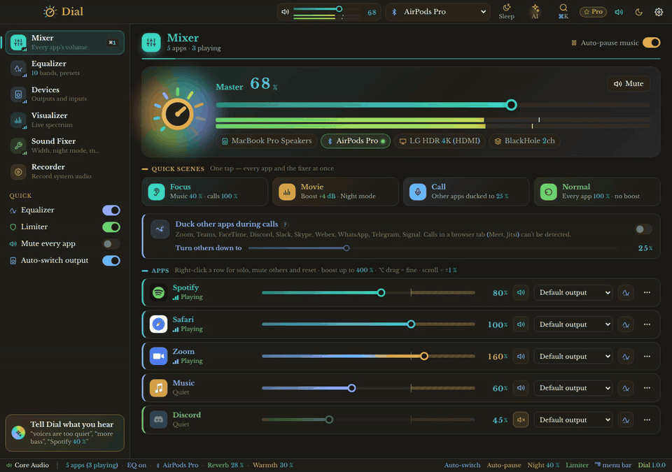</p>

**Mixer** — every app gets its own volume (0–100 %, up to 400 % with Pro), its own mute and its own colour. One tap on a
*Quick scene* — Focus, Movie, Call, Normal — sets every app and the sound fixer at once, with a burst of confetti.

<p align="center">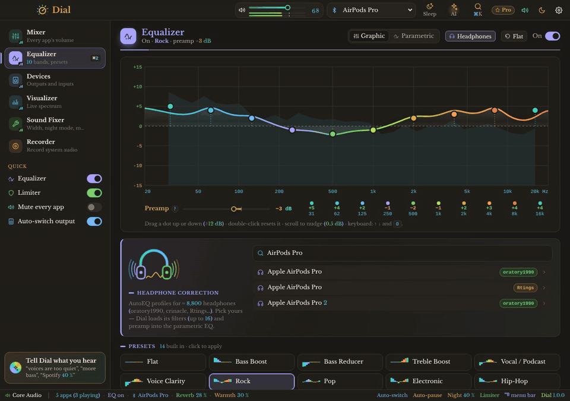</p>

**Equaliser** — drag the coloured dots on the live curve, tap a preset, or type your headphones' name: Dial pulls the
matching AutoEQ correction (≈ 8,800 headphones) into the parametric EQ in one click.

<p align="center">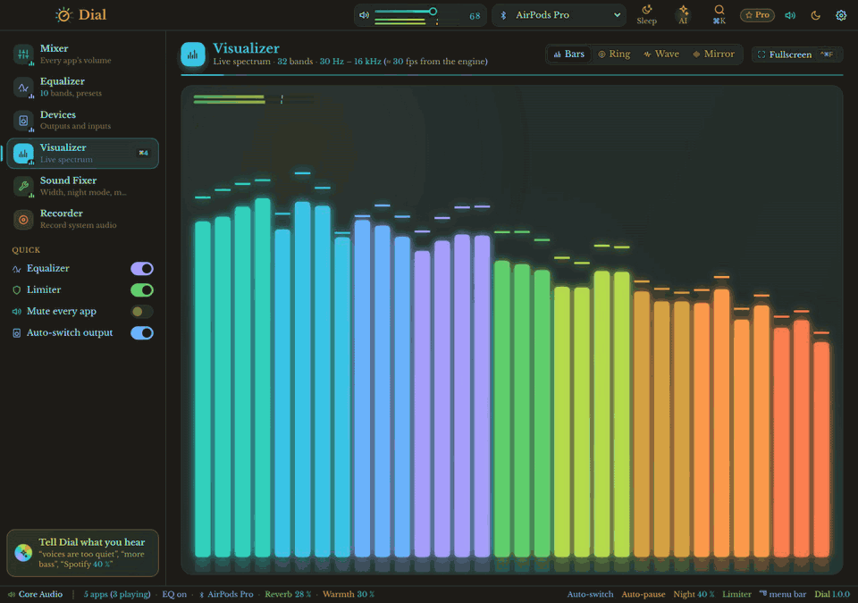</p>

**Visualiser** — a live spectrum of whatever you are hearing, in four looks: bars, ring, wave and mirror, all in Dial's
nine hues.

<p align="center">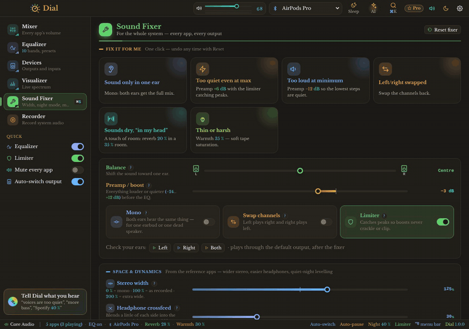</p>

**Sound fixer** — stretch the stereo width (the speakers slide apart), add a room or a hall of reverb (the rings bounce off
the walls) and tape-style warmth (the tube glows) — for headphones that sound flat or harsh.

<p align="center">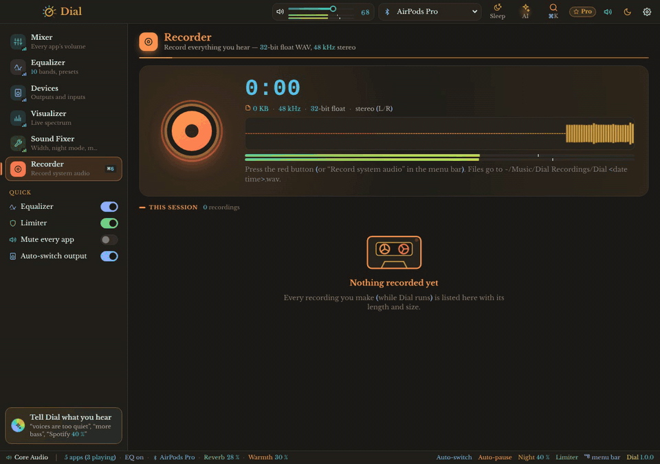</p>

**Recorder** — one button records everything you hear, after the EQ and the fixer, into a 32-bit WAV in
*Music → Dial Recordings*.

<p align="center">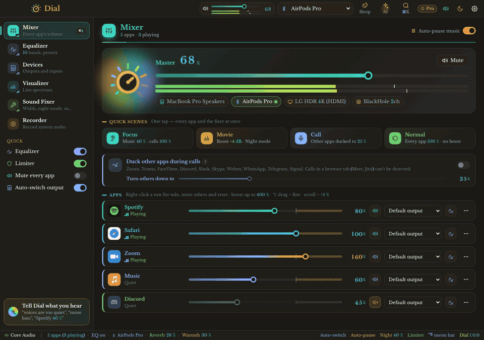</p>

**Dial AI** — just say it: *“more bass and make Spotify 40 %”* becomes a preview of exactly what will change and one gold
**Apply** button. Quick fixes work offline, with no account; the chat can use Dial AI, GitHub Copilot or any local model.

<p align="center">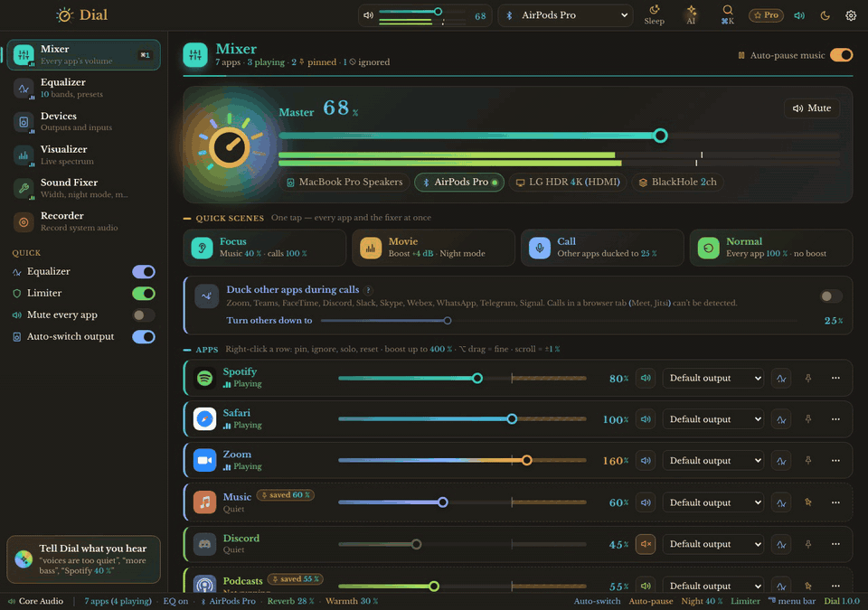</p>

**Global hotkeys and the volume HUD** — click a shortcut and press the keys: the keycaps drop in one by one (⌃ amber,
⌥ violet, ⇧ green, ⌘ blue) and a chime confirms it; keys that are already taken shake red and say by what. Then the
hotkeys work in every app — App volume up / down / mute (the loudest app), Master up / down / mute, the mini mixer,
the EQ, the microphone — and a small HUD slides up with the app's icon, its name and a glowing bar.

<p align="center">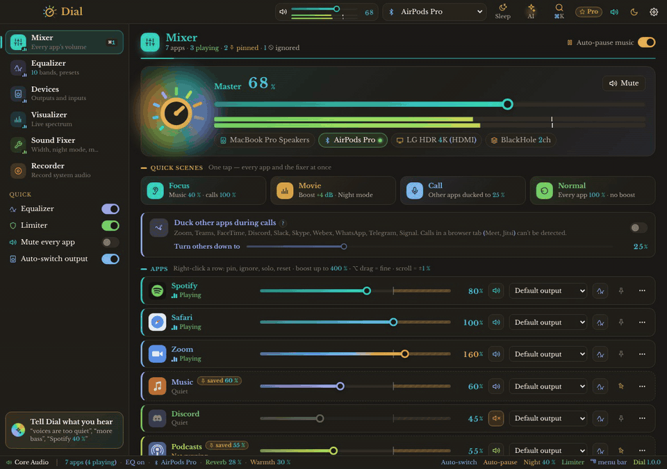</p>

**Automate Dial** — every `dial://` link in Settings → Automation is colour-coded (scheme, action, keys, values), one
click copies it and **Try** runs it with a sparkle. The builder makes your own: pick an action, an app or a device, a
level, and paste the link into Terminal, the Shortcuts app, Raycast or a script.

<p align="center">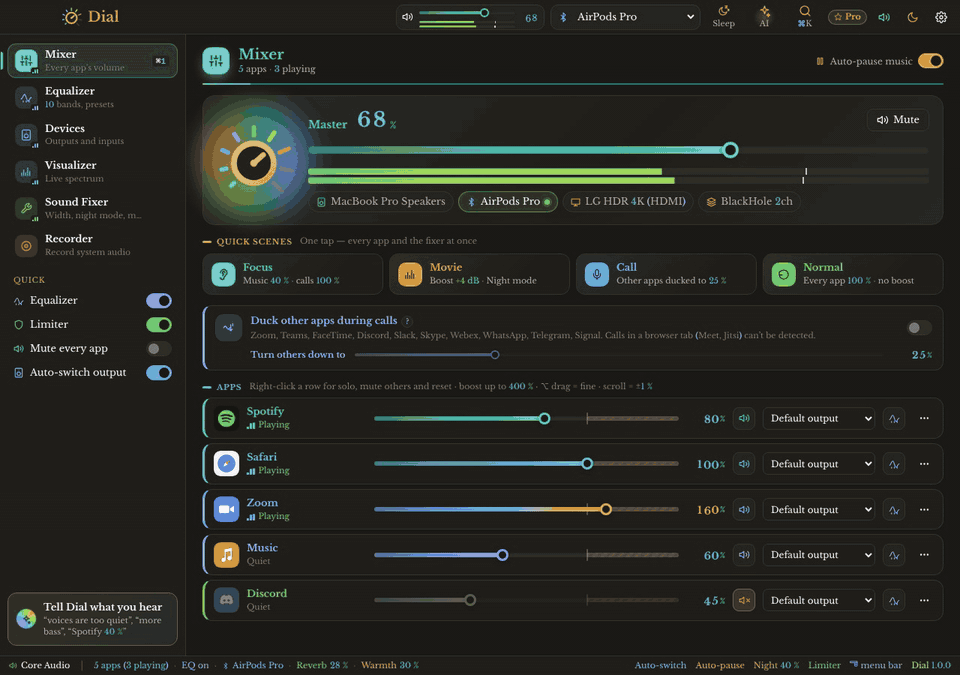</p>

**Light and dark** — both themes come from the icon's own gold and charcoal; switching grows a circle from the button.
Every number, unit and bracket keeps its colour in both.

## Automate Dial

Dial answers `dial://` links, so Terminal, the macOS Shortcuts app (*Open URLs*), Raycast / Alfred quicklinks, keyboard
daemons and scripts can drive it — macOS: `open "dial://volume?v=40"`, Linux: `xdg-open "dial://volume?v=40"`.
If Dial isn't running, the link starts it. Every link plays a small sparkle and shows what it did.

| Link | What it does |
|---|---|
| `dial://volume?v=40` | Master volume to 40 % (`v` 0–100) |
| `dial://mute` · `dial://unmute` · `dial://toggle-mute` | Mute, unmute or flip the master mute |
| `dial://app?name=Spotify&volume=30` | One app's volume (0–400 %; above 100 % is Pro) — the name matches loosely |
| `dial://app?name=Zoom&mute=1` | Mute (`1`) or unmute (`0`) one app |
| `dial://output?name=AirPods` | Switch the output device |
| `dial://preset?name=Rock` | Apply an EQ preset (built-in or yours) |
| `dial://eq?on=1` | Equalizer on (`1`) or off (`0`) |
| `dial://popover` | Open the mini mixer from the menu bar |
| `dial://record?on=1` | Start (`1`) or stop (`0`) recording system audio (Pro) |
| `dial://sleep?minutes=30` | Sleep timer — fade out and mute after 30 min (`0` = off) |

Settings → Automation lists them all with Copy and Try buttons, and builds your own.

## Features

✓ = in Dial Free · ★ = Dial Pro

| | Feature | Free | Pro |
|---|---|:---:|:---:|
| 🔊 | **Master volume and mute**, output and input device switching, per-device volume | ✓ | ✓ |
| 🎚️ | **Per-app volume 0–100 % and mute**, for every app — remembered per app | ✓ | ✓ |
| 🚀 | **Per-app boost above 100 %**, up to 400 % | — | ★ |
| 🎛️ | **10-band graphic equaliser** with 14 built-in presets (Bass Boost, Vocal / Podcast, Late Night…) | ✓ | ✓ |
| 📈 | **Parametric equaliser** — up to 16 bands, type / frequency / gain / Q | — | ★ |
| 💾 | **Custom presets** — save, rename, delete, import and export as JSON | 1 slot | ★ unlimited |
| 🎧 | **Per-app EQ** — one app gets its own curve (macOS) | — | ★ |
| 🔀 | **Per-app output device** — one app to headphones, another to speakers | — | ★ |
| 🩺 | **Sound fixer:** balance and preamp | ✓ | ✓ |
| 🛡️ | **Sound fixer:** mono, left/right swap, limiter | — | ★ |
| 🌈 | **Spectrum visualiser** — bars, ring, wave, mirror | ✓ | ✓ |
| 🧭 | **Menu bar popover** — every output, microphone and app at a glance, live level meters, Donate and Quit (FineTune style) | ✓ | ✓ |
| 🎧 | **Bluetooth headphones** — connect / disconnect paired headphones and speakers from Dial | ✓ | ✓ |
| 🎙️ | **Microphone mute** and live mic level (menu bar, popover, Devices) | ✓ | ✓ |
| 📌 | **Pin apps** (they stay in the list when quiet, with their saved volume) and **ignore apps** (Dial leaves them alone) | ✓ | ✓ |
| ⌨️ | **Global hotkeys** for app / master volume, mute, the mini mixer, the EQ and the microphone, with a volume HUD | ✓ | ✓ |
| 🔗 | **`dial://` automation links** — Terminal, Shortcuts, Raycast, scripts | ✓ | ✓ |
| 👂 | **Loudness compensation** — bass and treble back at low volume | — | ★ |
| 🎛️ | **Menu bar icon styles** (knob, speaker, wave, bars) and popover density; full keyboard control of the mini mixer | ✓ | ✓ |
| ✨ | **AI:** Dial AI (free, built in), offline quick fixes, GitHub Copilot CLI, GitHub Models, every local server (Ollama, LM Studio, Jan, llama.cpp, GPT4All, KoboldCpp, vLLM, text-generation-webui, Msty, AnythingLLM) and any OpenAI-compatible service | ✓ | ✓ |

Keyboard: Mixer ⌘1 · Equaliser ⌘2 · Devices ⌘3 · Visualiser ⌘4 · Sound Fixer ⌘5 · AI panel ⌘J.

## Screenshots

Each screenshot follows your theme (dark or light).

| | |
|---|---|
| <picture><source media="(prefers-color-scheme: dark)" srcset="screenshots/mixer-dark.png">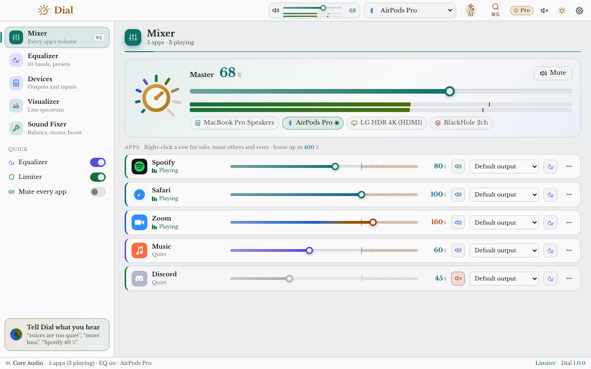</picture> <br> *Mixer — a volume, mute and output for every app* | <picture><source media="(prefers-color-scheme: dark)" srcset="screenshots/eq-dark.png">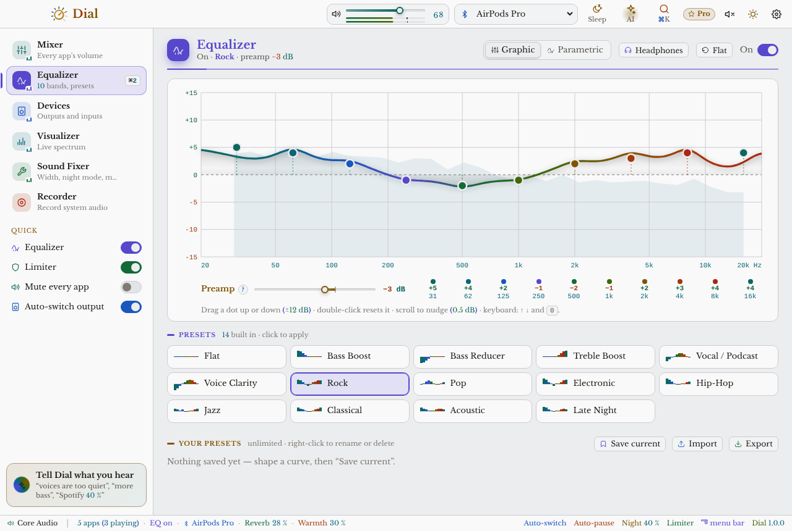</picture> <br> *Equaliser — graphic or parametric, with presets* |
| <picture><source media="(prefers-color-scheme: dark)" srcset="screenshots/devices-dark.png">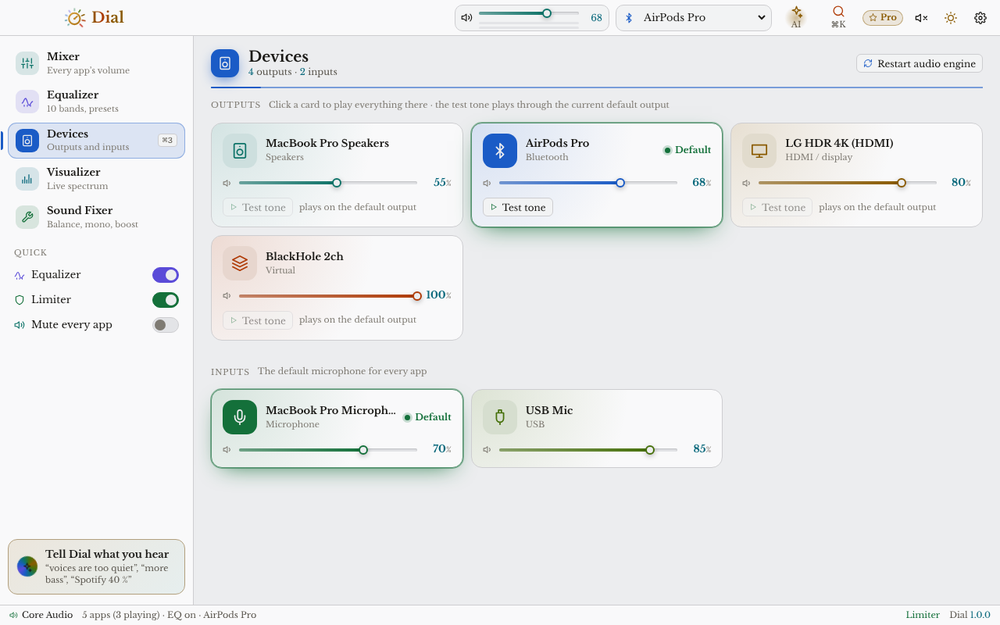</picture> <br> *Devices — speakers, headphones, Bluetooth and the microphone* | <picture><source media="(prefers-color-scheme: dark)" srcset="screenshots/visualizer-dark.png">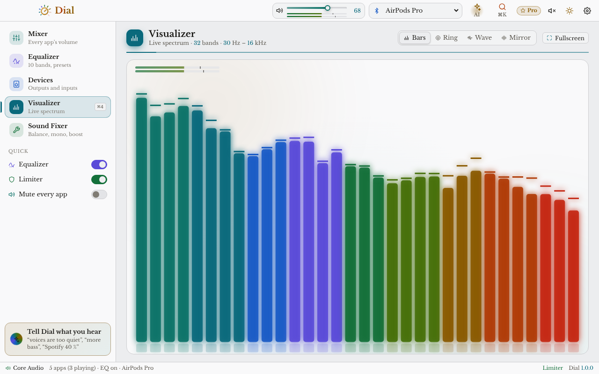</picture> <br> *Visualiser — bars, ring, wave and mirror* |
| <picture><source media="(prefers-color-scheme: dark)" srcset="screenshots/fixer-dark.png">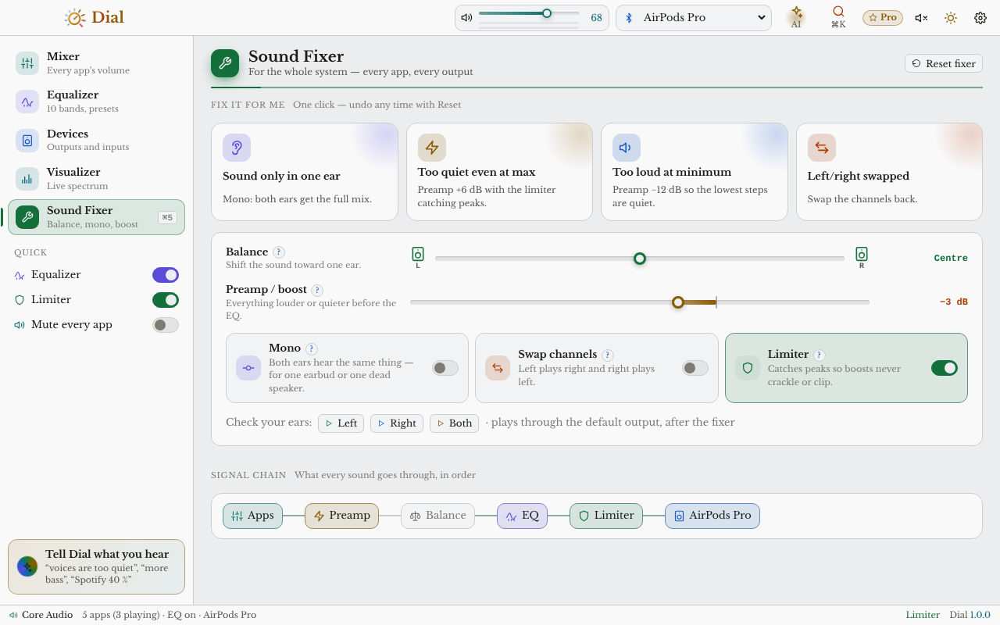</picture> <br> *Sound fixer — balance, preamp, mono, swap, limiter* | <picture><source media="(prefers-color-scheme: dark)" srcset="screenshots/ai-chat-dark.png">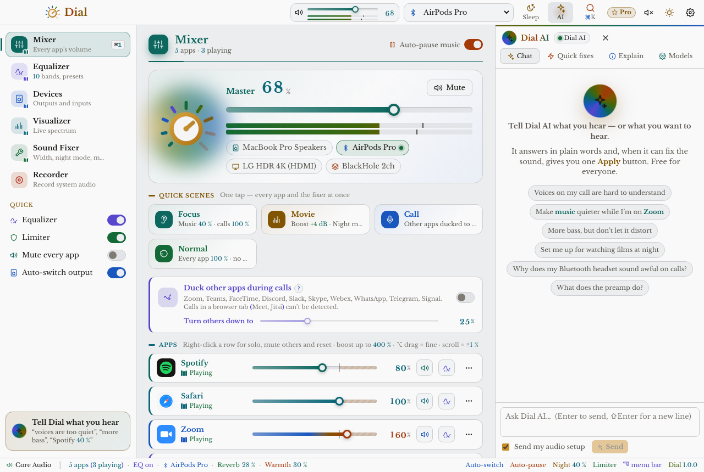</picture> <br> *Dial AI — say what you want to hear* |
| <picture><source media="(prefers-color-scheme: dark)" srcset="screenshots/popover-dark.png">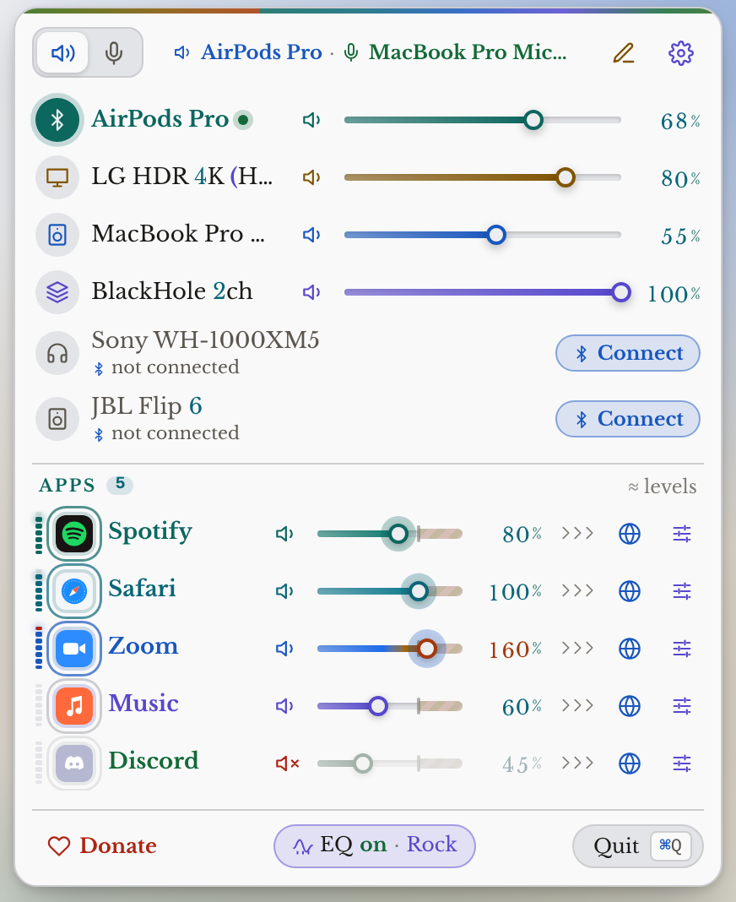</picture> <br> *Menu bar popover — devices, Bluetooth and apps* | <picture><source media="(prefers-color-scheme: dark)" srcset="screenshots/popover-input-dark.png">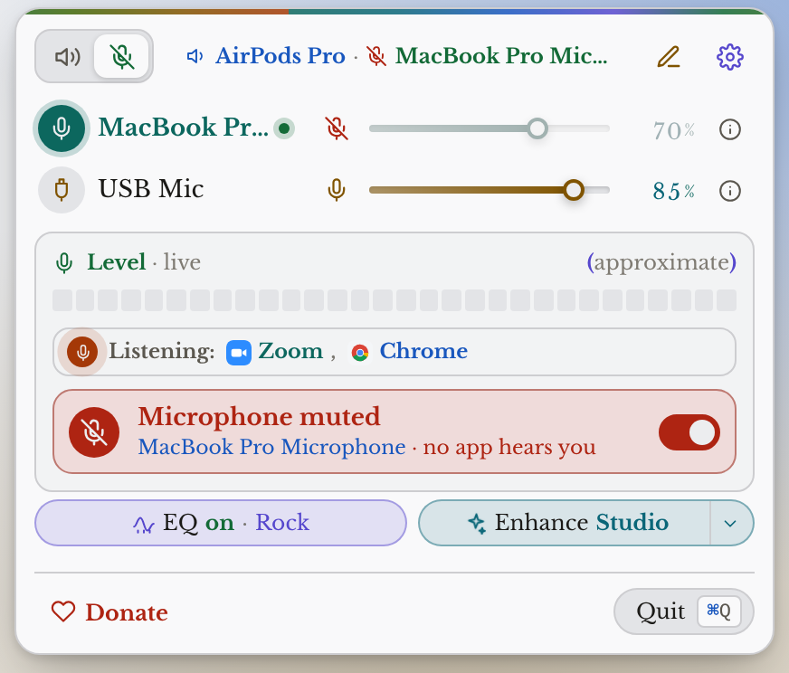</picture> <br> *Microphone tab — live level and mute* |

## Install

One line in a terminal works on **macOS, Linux, ChromeOS and FreeBSD**:

```bash
curl -fsSL https://ipconfig.co.network/updates/dial/install.sh | bash
```

**macOS** (Apple silicon and Intel, macOS 10.15+) — the installer picks the right build, copies **Dial.app** to
`/Applications` and clears the quarantine flag. If you install from the DMG by hand instead, run this once
before the first launch (Dial is ad-hoc signed, not notarized):

```bash
xattr -cr /Applications/Dial.app
```

Per-app volume, per-app EQ and the equaliser use Core Audio process taps, which need **macOS 14.4 or later**
and the **System Audio Recording Only** permission (System Settings → Privacy & Security) — Dial asks once.
On older macOS, Dial controls the master volume and devices.

**Linux** (x86_64) — works with **PipeWire** and **PulseAudio**; Dial uses `pactl` / `parec` from
`pulseaudio-utils` (the packages pull it in, and the installer adds it when `pactl` is missing).

- Debian / Ubuntu / Mint: the installer uses the `.deb`, or download `Dial_1.0.2_amd64.deb` and
  `sudo apt install ./Dial_1.0.2_amd64.deb`.
- Fedora: `sudo dnf install ./Dial_1.0.2_x86_64.rpm` · openSUSE:
  `sudo zypper install --allow-unsigned-rpm ./Dial_1.0.2_x86_64.rpm`.
- Any distribution: `Dial_1.0.2_amd64.AppImage` — `chmod +x Dial_*.AppImage && ./Dial_*.AppImage`
  (needs `libfuse2`), or `… | bash -s -- --appimage` to install it to `~/.local/bin/dial`.

**Linux ARM64** (Raspberry Pi 4/5 with a 64-bit OS, ARM laptops) — Debian / Ubuntu: the same one-liner, or
download `Dial_1.0.2_arm64.deb` and `sudo apt install ./Dial_1.0.2_arm64.deb`.
ARM64 Linux has a `.deb` only — there is no ARM AppImage or `.rpm`.

**ChromeOS** — Dial runs in the Linux development environment (a Debian container), on Intel/AMD and ARM Chromebooks:

1. **Settings → Advanced → Developers → Linux development environment → Turn on** (a few minutes the first time).
2. Open the **Terminal** app and run the one-liner above — it detects ChromeOS and picks the right package.
   Or by hand: `dpkg --print-architecture` says `amd64` (Intel/AMD) or `arm64` (ARM). Download
   `Dial_1.0.2_amd64.deb` or `Dial_1.0.2_arm64.deb`, move it to **Linux files** and double-click it —
   or run `sudo apt install ./Dial_1.0.2_<arch>.deb`.
3. Open Dial from the launcher (**Linux apps**). It mixes the sound of the apps in the Linux container.

**FreeBSD** (amd64, FreeBSD 14 or later, with a desktop) — as root:

```sh
pkg install pulseaudio webkit2-gtk_41 bash curl
curl -fsSL https://ipconfig.co.network/updates/dial/install.sh | bash
```

Or download `Dial_1.0.2_freebsd_amd64.tar.gz` and, in the download folder,
`tar -xzf Dial_1.0.2_freebsd_amd64.tar.gz && sudo sh install.sh` — it installs to `/usr/local/bin/dial`
with a menu entry and icon (`sh install.sh --uninstall` removes them). With PulseAudio running Dial mixes every
app; without it, Dial controls the OSS master volume.

**Haiku** — not possible: Haiku isn't supported because Dial's window engine (Tauri/WebKit) has no Haiku port.

**Windows** — not available yet.

Dial updates itself on macOS and Linux (AppImage, `.deb` and `.rpm`; x86_64 and ARM64): when a new version is
out it offers to install it and restart, and checks the update's signature first. A `.deb` or `.rpm` update asks
for your password, like any package install. On FreeBSD, run the installer again to update.

## Platforms

| System | CPU | Download | Updates itself |
|---|---|---|---|
| macOS 10.15+ (per-app audio: 14.4+) | Apple silicon | `Dial_1.0.2_aarch64.dmg` | yes |
| macOS 10.15+ (per-app audio: 14.4+) | Intel | `Dial_1.0.2_x64.dmg` | yes |
| Linux, any distribution | x86_64 | `Dial_1.0.2_amd64.AppImage` | yes |
| Debian / Ubuntu / Mint | x86_64 · ARM64 | `Dial_1.0.2_amd64.deb` · `Dial_1.0.2_arm64.deb` | yes |
| Fedora / openSUSE | x86_64 | `Dial_1.0.2_x86_64.rpm` | yes |
| ChromeOS (Linux development environment) | x86_64 / ARM64 | the `.deb` for the Chromebook's CPU | yes |
| FreeBSD 14+ | amd64 | `Dial_1.0.2_freebsd_amd64.tar.gz` | no — rerun the installer |
| Windows | — | not available yet | — |
| Haiku | — | not possible | — |

## Pricing

| Free | Pro monthly | Pro yearly |
|---|---|---|
| ₹0 | **₹20 / month** | **₹220 / year** |
| Per-app volume, the graphic EQ and presets, devices, balance and preamp, the visualiser and all the AI | Boost to 400 %, parametric and per-app EQ, per-app outputs, mono / swap / limiter, unlimited presets | Everything in Pro — two months cheaper |

After paying you get an activation code at once, and Pro turns on by itself if you bought from inside Dial.

[Get Dial Pro →](https://ipconfig.co.network/dial/buy?plan=monthly) · [yearly](https://ipconfig.co.network/dial/buy?plan=yearly)

## Links

- Releases and downloads: https://github.com/JKS-sys/dial-08-oct-2026-releases/releases
- Website: https://ipconfig.co.network/dial
- Release notes: [RELEASE-NOTES.md](RELEASE-NOTES.md)
- Update feed: [latest.json](latest.json)

## Creator

Made by Jagadeesh Kumar S, creator — [youtube.com/@JKS-sys](https://www.youtube.com/@JKS-sys)

## Licence

Proprietary. © 2026 Jagadeesh Kumar S. All rights reserved.
The installers are free to download and use; the source code is not published, and copying,
modifying or redistributing Dial is not permitted without written permission.
